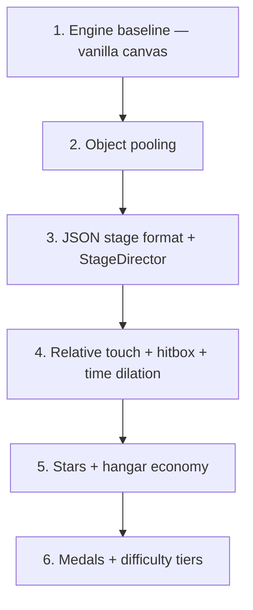

# Design Requirements Document (DRD)

**Project:** Sky Force Reloaded (Browser)  
**Reference:** Infinite Dreams — *Sky Force Reloaded* (2016)  
**Companion docs:** [[GDD]], [[ARCHITECTURE]], [[ROADMAP]]

Sky Force stands out from classic bullet-hells through **tactical pacing**, **visual polish**, and an **RPG-like progression loop**. This DRD defines the five pillars every implementation decision must serve.

---

## Pillar 1 — Core Gameplay (In-Level Experience)

90% of player time. Controls must feel **responsive and fair**.

### Camera & movement

| Requirement | Spec | Status |
|-------------|------|--------|
| Vertical scroll | Portrait 9:16 logical canvas; letterbox on widescreen | ✓ v0.1 |
| Locked aspect | 360×640 internal, CSS scale only | ✓ v0.1 |
| **Relative touch** | Ship follows **delta vector**, not absolute finger position — hand never covers ship | Planned v0.3 |
| **Tiny hitbox** | Visual hull large; collision circle ~4px at center | Planned v0.3 |
| Movement bounds | Lower ~55% of playfield | ✓ v0.1 |

### Combat

| Requirement | Spec | Status |
|-------------|------|--------|
| Auto-fire primary | Fires while touching screen / optional always-on | Partial v0.1 |
| Secondary triggers | Shield, Laser, Megabomb — edge UI buttons | v0.8+ |
| **Time dilation** | Slow-mo when finger lifted / control released — plan power-up use | Planned v0.3 |
| Weapon upgrades | In-run pickup spikes + hangar baseline | Partial v0.1 |

### Enemies & bullets

| Requirement | Spec | Status |
|-------------|------|--------|
| Air units | Bézier path flight | v0.5 |
| Ground units | Scroll with map layer | v0.5 |
| **Deterministic patterns** | Scripted emitters, not random spreads | v0.4 (JSON) |
| Telegraph | Red aim lines before heavy shots | v0.5 |

---

## Pillar 2 — Meta-Progression & Economy

Without this loop, replayability collapses.

| System | Mechanics | Purpose | Status |
|--------|-----------|---------|--------|
| **Stars** | Drop from enemies; vacuum when near (magnet upgrade) | Hangar currency | v0.4 |
| **Hangar** | Main cannon, wing guns, HP, magnet, power-ups — exponential cost curve | Persistent power | v0.6 |
| **Cards / parts** | Rare mid-level drops; kept only if stage survived | Passive buffs, new ships | v1.0+ |

**Economy rule:** Each upgrade tier has ~10 blocks; cost grows exponentially so full max-out requires many replays. **Full math:** [[ECONOMY-SPEC]] (`cost = floor(base × r^level)`, heavy-grind: MVP **29,490★** / ~16 clears, full hangar **101,595★** / ~54 clears).

**Depth rule:** Features must create **risk vs reward** decisions — not uniform hold-to-shoot. See [[MECHANICS-DEPTH]] (crates, technicians, gimmick stages, chain-break combo).

---

## Pillar 3 — Level & Mission Design

Quality over quantity — intense replay on few stages.

### Medal system (4 per stage)

| Medal | Example condition |
|-------|-------------------|
| Completion | Finish stage |
| Annihilation | Destroy 100% of enemies |
| Pacifist variant | Destroy ≥70% (easier tier) |
| Rescue | All survivors collected |
| Ace | No shield damage taken |

All 4 medals → unlock **Hard**, then **Insane**, **Nightmare** (HP ×, bullet speed ×, star reward ×).

### Interactive objectives

- **Survivors:** Hover 2s without leaving radius to rescue  
- **Sassy hostages:** Speech bubbles; angry scramble if rescue interrupted ([[MECHANICS-DEPTH#5.1]])  
- VIP survivors: bonus stars + score  
- **Escort crate:** Magnet to landing zone; permanent card on success (v1.0)  
- Status: survivors v0.8; crate v1.0

### Data-driven stages

Enemy spawns, paths, and bullet configs **must not be hardcoded**. See `data/stages/*.json` and [[ARCHITECTURE#Stage scripts]].

---

## Pillar 4 — Visual & Audio

High-fidelity tactile feedback — "crunchy" and expensive-feeling.

| Requirement | Spec | Status |
|-------------|------|--------|
| Telegraph danger | Boss aim lines, flash before burst | v0.5 |
| Damage states | Smoking → fire → explode | v0.6 |
| Star pickup SFX | Distinct chime | v0.7 |
| Rescue fill tone | Rising pitch | v0.8 |
| Voice announcer | "Megabomb ready", "Human rescued" | v1.0+ |

---

## Pillar 5 — Technical Architecture

### Engine decision

| Option | Verdict |
|--------|---------|
| **Vanilla Canvas 2D + classic scripts** | **Current choice (v0.1–v0.7).** Zero build step, works on `file://`, matches `run-a-hotel` pattern. Sufficient for ~100 concurrent bullets + particles. |
| **Phaser 3 + Vite** | Migrate when: sprite atlases, complex particles, tilemap ground layers, or Web Audio mixer exceed canvas comfort zone. |
| **Unity / Godot** | Overkill for browser-first MVP; reconsider only for native mobile ship. |

**Recommendation:** Stay on vanilla canvas through hangar + stage 3. Re-evaluate at v0.7 agent QA milestone.

### Object pooling (required)

Shmups spawn hundreds of bullets/stars/particles per minute. **Never allocate in the hot loop.**

- Generic `ObjectPool` in `js/object-pool.js`  
- `BulletPool` acquires/releases from pool — no `.filter()` churn  
- Extend pools to: stars, particles, floating damage numbers (v0.4+)

### Data-driven level editor (required)

JSON stage files define:

- Timeline events (`spawn`, `pattern`, `boss`, `dialogue`)  
- Enemy type, position, path (Bézier control points)  
- Bullet emitter configs (pattern id + params)

`StageDirector` reads JSON and commands spawn systems. See `data/stages/stage-01.json`.

---

## Build order (recommended)

**You are here:** steps 1–2 done; step 3 scaffolded in this pass.

---

## Acceptance criteria (DRD compliance)

- [x] Relative touch movement (not absolute jump-to-finger)  
- [x] Center hitbox ≤ 25% of visual radius (4px / 14px)  
- [x] Time dilation on control release (20% Focus Time)  
- [x] Object pools for bullets  
- [x] Stage 1 fully JSON-driven (campaign mode)  
- [x] 4 medals + difficulty tiers on stage 1  
- [x] Hangar with exponential star costs (8 modules)  
- [x] Boss two-phase patterns + rage telegraph  
- [ ] Pause menu  
- [ ] Chain break on enemy escape  
- [ ] Modular boss parts  

See **`docs/FEATURES-AND-DESIGN.md`** §17 for full implemented vs planned matrix.

---

*Last updated: 2026-06-06*
