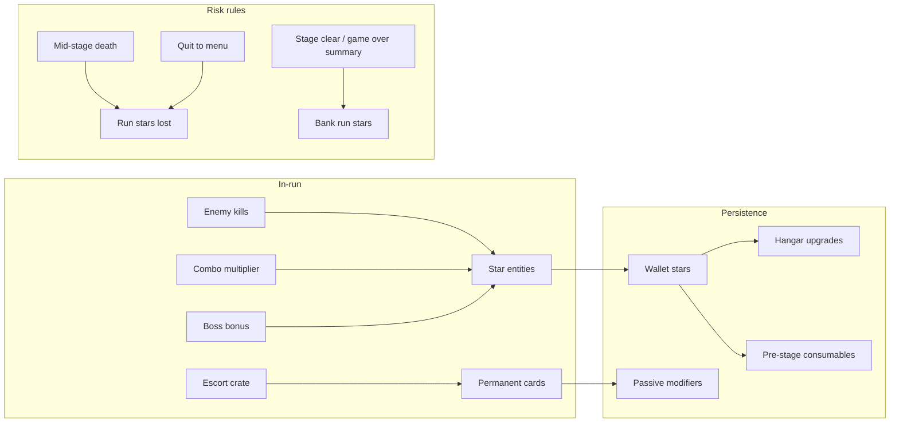

# Economy & Hangar Balancing — Sky Force Reloaded (Browser)

**Companion docs:** [[GDD]], [[DRD]], [[MECHANICS-DEPTH]], [[UI-SPEC#S09 — Hangar]]

This document defines the **math** behind star income, hangar prices, upgrade power curves, and how long progression should take. Use it when implementing v0.6 Hangar and when tuning difficulty.

---

## 1. Design Goals

| Goal | Target | Why |
|------|--------|-----|
| First purchase feels fast | ≤ 1 Stage 1 clear | Hook the meta loop early |
| First **module max** | 12–18 Stage 1 clears | Meaningful mid-game plateau |
| Full 3-module hangar (MVP) | **~16 Stage 1 clears** (~29,500★) | SF2014-weight grind on core trio |
| Full 8-module hangar (v1.0) | **~54 Stage 1 clears** (~101,600★) | Matches SF2014 all-upgrades total |
| No dead currency | Stars always have next upgrade or pre-stage consumable | Avoid hoarding with nothing to buy |

**Active profile:** `heavy-grind` (v2 in `data/economy/hangar.json`).

**Reference:** Sky Force Reloaded uses ~10 upgrade blocks per module, shared across ships, with steep late-tier costs. Sky Force 2014 published fixed tables totaling **101,620★** for all modules ([Hangar wiki](https://skyforce2014.fandom.com/wiki/Hangar)). Reloaded uses fewer tiers per module but similar exponential feel.

---

## 2. Currency Flow



| Rule | Spec |
|------|------|
| Pickup value | Small star entity = **10★** base (matches v0.2 prototype) |
| Banking | Stars collected in-run bank **only** on stage clear or game-over summary |
| Mid-quit | No banking (anti-exploit) |
| Card drops | Permanent cards **never** lost on death once collected to inventory (v1.0+) |

---

## 3. Star Income Model

### 3.1 Per-enemy drops (in-run)

| Enemy | Base drop | Notes |
|-------|-----------|-------|
| Scout | 10★ (1 entity) | 50% single, 50% none on low tiers |
| Fighter | 20★ | 2×10 entities or 1×20 |
| Tank | 40★ | Often 4×10 burst |
| Turret | 15★ | Fixed position; magnet-friendly |
| Boss part | 80–150★ | Per destroyed submodule (v0.9+) |
| Boss core | 400★ | One-time on kill |

### 3.2 Stage payout formula

```
stageStars = floor(
  enemyStars * difficultyStarMult
  + clearBonus
  + medalBonus
  + rescueBonus
)

where:
  enemyStars     = sum of collected star entity values (already combo-scaled in-run)
  difficultyStarMult = { Normal: 1.0, Hard: 1.25, Nightmare: 1.6 }
  clearBonus     = 125 + (stageId * 40)        // Stage 1 = 165, Stage 3 = 245
  medalBonus     = 100 * medalsEarnedThisRun   // max 4
  rescueBonus    = 50 * survivorsRescued       // v0.8+
```

**Combo multiplier (in-run):**

```
comboMultScore = min(4, 1 + floor(combo / 5))   // score: x1 → x4
comboMultStars = min(2, comboMultScore)         // stars: capped at x2 (grind lever)
combo += 1 on kill; resets after 3s without kill
```

**Chain break (see MECHANICS-DEPTH):**

```
if enemy escapes screen alive:
  combo = 0
  comboMultScore = comboMultStars = 1
  runStars = floor(runStars * 0.9)   // -10% banked-this-run penalty
```

### 3.3 Worked example — Stage 1, Normal, average player

| Source | Estimate |
|--------|----------|
| ~95 kills × 12★ avg × 1.12 combo avg (×2 star cap) | ~1,275★ |
| Boss core + parts | ~400★ |
| Clear bonus | 165★ |
| 1 medal (completion) | 100★ |
| **Total banked** | **~1,940★** |

| Player skill | Stage 1 banked |
|--------------|----------------|
| Struggling (50% kills, no boss) | ~400★ |
| Average clear | ~1,700–2,100★ |
| Perfect (100% kills, 4 medals, no escapes) | ~2,800★ |

Use **1,900★** as the balance anchor for “one average Stage 1 clear.” Hard/Nightmare multipliers (×1.3 / ×1.75) are the intended relief valve for farming.

---

## 4. Hangar Cost Curve

### 4.1 Core formula

Each module has levels `0 … Lmax-1` (MVP: **Lmax = 10** per module).

```
unlockCost(module)     // paid once before level 0→1 (0 for starter modules)
cost(level) = floor( baseCost[module] * pow(growth[module], level) )
totalModuleCost = unlockCost + sum(cost(i) for i in 0..Lmax-1)
```

Round to nearest **5★** for UI readability: `round5(n) = 5 * round(n / 5)`.

### 4.2 MVP module table (v0.6 — 3 modules, heavy grind)

| Module | Unlock | Base | Growth `r` | Lmax | Total to max |
|--------|--------|------|------------|------|--------------|
| **HP / Shield** | 0 | 50★ | 1.48 | 10 | **5,150★** |
| **Main cannon** | 0 | 100★ | 1.51 | 10 | **11,890★** |
| **Magnet** | **2,000★** | 80★ | 1.53 | 10 | **12,450★** |
| **All three** | | | | | **29,490★** |

At **1,900★/clear**, full 3-module max ≈ **16 average clears**. Magnet unlock alone is a **session-long goal** (~1 clear + savings).

### 4.3 Per-level costs (Main Cannon, base=100, r=1.51)

| Level | Cost | Cumulative |
|-------|------|------------|
| 1 | 100★ | 100★ |
| 2 | 150★ | 250★ |
| 3 | 230★ | 480★ |
| 4 | 345★ | 825★ |
| 5 | 520★ | 1,345★ |
| 6 | 785★ | 2,130★ |
| 7 | 1,185★ | 3,315★ |
| 8 | 1,790★ | 5,105★ |
| 9 | 2,705★ | 7,810★ |
| 10 | **4,080★** | **11,890★** |

Late tiers are **multi-clear commitments** — L9–L10 cannon alone ≈ 3 Stage 1 runs.

*(All costs rounded to nearest 5★.)*

### 4.4 Full hangar (v1.0 — 7 modules)

| Module | Unlock | Base | Growth | Lmax | Total |
|--------|--------|------|--------|------|-------|
| HP | 0 | 50 | 1.48 | 10 | 5,150★ |
| Main cannon | 0 | 100 | 1.51 | 10 | 11,890★ |
| Magnet | 2,000 | 80 | 1.53 | 10 | 12,450★ |
| Wing cannons | 6,000 | 160 | 1.57 | 10 | 31,255★ |
| Missiles | 7,000 | 200 | 1.59 | 8 | 20,510★ |
| Energy shield stock | 6,000 | 170 | 1.57 | 6 | 10,170★ |
| Mega bomb stock | 6,000 | 170 | 1.57 | 6 | 10,170★ |
| **Grand total** | | | | | **101,595★** |

Matches Sky Force 2014 published all-upgrade total (**101,620★**). At 1,900★/clear ≈ **54 clears**; with Hard mode farming (×1.3) ≈ **42 clears**.

---

## 5. Upgrade Power Curves

Cost is only half the balance — **power per star** must feel fair.

### 5.1 Effective HP (shield max)

```
shieldMax(level) = 100 + level * 15        // L10 → 250 shield (slower curve = grind feels earned)
```

| Level | Shield max | Marginal gain |
|-------|------------|---------------|
| 0 | 100 | — |
| 5 | 175 | +15/upgrade |
| 10 | 250 | +150% vs base |

**Design check:** Stage 2 on fresh account should **require farming** — expect HP ≥ 6 and Cannon ≥ 5 before first comfortable clear (~8–10 Stage 1 runs).

### 5.2 Main cannon DPS index

```
dpsIndex(level) = 1.0 + level * 0.10       // L10 → 2.0× base DPS
firePattern(level) = min(4, 1 + floor(level / 3))  // spread tiers at 3, 6, 9
```

| Level | DPS mult | Pattern |
|-------|----------|---------|
| 0 | 1.0× | Single |
| 3 | 1.30× | Dual |
| 6 | 1.60× | Triple |
| 9 | 1.90× | Wide |
| 10 | 2.0× | Wide + faster ROF tick |

### 5.3 Magnet radius (px at 360w canvas)

```
magnetRadius(level) = level === 0 ? 0 : 40 + level * 12   // L10 → 160px
magnetStrength(level) = 100 + level * 30   // pull speed px/s toward ship
```

Magnet is **QoL + income** — price it higher (unlock gate + steeper growth) so combat upgrades come first, matching Reloaded priority: **HP → Cannon → Magnet**.

---

## 6. Progression Pacing Table

Expected clears to afford key milestones (average **1,900★**/Stage 1 clear, spending all stars):

| Milestone | Cumulative spend | Clears (approx) |
|-----------|------------------|-----------------|
| Cannon L1 | 100★ | <1 |
| HP L3 | ~235★ | 1 |
| Cannon L5 | ~1,345★ | 1–2 |
| Magnet unlock | 2,000★ | **2** |
| HP max | 5,150★ | **3** |
| Cannon max | 11,890★ | **7** |
| All MVP max | 29,490★ | **16** |
| Full hangar max | 101,595★ | **54** |

**Gate Stage 2 without upgrades:** Stage 2 enemy HP ×1.4, bullet speed +10% — first clear attempt should fail; return after **HP 6 + Cannon 5** (~8–10 farms).

---

## 7. Pre-Stage Consumables (v1.0)

Reloaded lets players buy shield/bomb charges before launch. Use **flat + linear** pricing (not exponential) so stars remain useful after hangar max:

```
consumableCost(count) = baseConsumable * (1 + 0.15 * countBoughtThisWeek)
```

| Item | Base | Max stock |
|------|------|-----------|
| Energy shield charge | 200★ | 3 |
| Mega bomb charge | 350★ | 2 |

---

## 8. Card & Modifier Discounts

| Modifier | Effect on economy |
|----------|-------------------|
| Gold card “-10% hangar” | `cost' = floor(cost * 0.9)` |
| Star doubler (end of stage) | `banked *= 2` — doubles pacing, not shop prices |
| Technician “Kate Brush” | No direct economy change |
| Escort crate card reward | Permanent passive; **not** sold in hangar |

**Rule:** Discounts apply to star **prices**, not power levels — never stack multiplicative discounts below 0.75×.

---

## 9. Implementation Schema

```javascript
// data/economy/hangar.json (profile: heavy-grind, v2)
{
  "version": 2,
  "profile": "heavy-grind",
  "modules": {
    "hp": { "unlock": 0, "base": 50, "growth": 1.48, "maxLevel": 10 },
    "cannon": { "unlock": 0, "base": 100, "growth": 1.51, "maxLevel": 10 },
    "magnet": { "unlock": 2000, "base": 80, "growth": 1.53, "maxLevel": 10 }
  },
  "stagePayout": {
    "clearBase": 150,
    "clearPerStage": 50,
    "medalBonus": 100
  },
  "combo": { "capScore": 4, "capStars": 2, "killsPerStep": 5, "decaySec": 3 }
}
```

```javascript
function upgradeCost(module, level) {
  const m = hangar.modules[module];
  if (level >= m.maxLevel) return null;
  const raw = m.base * Math.pow(m.growth, level);
  return 5 * Math.round(raw / 5);
}

function canAfford(wallet, module, currentLevel) {
  const unlock = currentLevel === 0 && m.unlock ? m.unlock : 0;
  return wallet >= unlock + upgradeCost(module, currentLevel);
}
```

Persist in `localStorage` under `sky-force-reloaded/v1/save`:

```javascript
{
  stars: 2240,
  hangar: { hp: 3, cannon: 5, magnet: 0 },
  cards: ["fire_rate_10"],
  technicians: { equipped: "slo_mo_chan" }
}
```

---

## 10. Balance Validation Checklist

Before shipping v0.6 Hangar:

- [ ] Sim: 100 agent runs → median Stage 1 banked stars within **1,500–2,200★**
- [ ] Fresh account beats Stage 2 after **8–12** Stage 1 farms (HP≥6, Cannon≥5)
- [ ] Magnet unlock at **2,000★** reached around clear **#2**
- [ ] Last MVP upgrade costs **≥ 3,500★** (multi-session goal)
- [ ] No upgrade increases DPS/HP more than **15% per step** (avoid spike power)

---

## 11. Tuning Knobs (when playtests feel wrong)

| Symptom | Knob |
|---------|------|
| Grind too long | Lower `growth` by 0.02 or raise `capStars` to 3 |
| Grind too short | Raise `growth` by 0.02 or lower clear bonus |
| Upgrades feel meaningless | Raise `dpsIndex` slope (+0.02/level) or lower enemy HP |
| Magnet skipped | Lower `unlock` from 2,000→1,500 |
| Players hoard stars | Add pre-stage consumables or next-module teaser |
| Combo dominates income | Cap combo at ×3 for star value (keep ×4 for score only) |

---

*Last updated: 2026-06-06*
