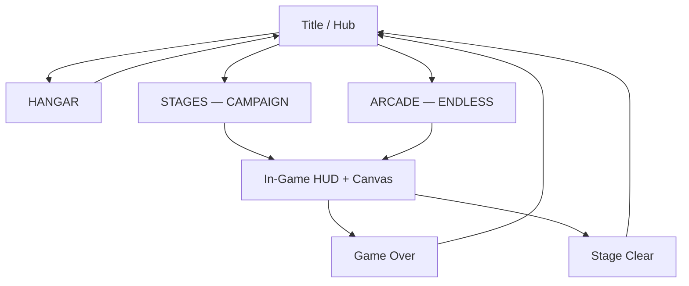
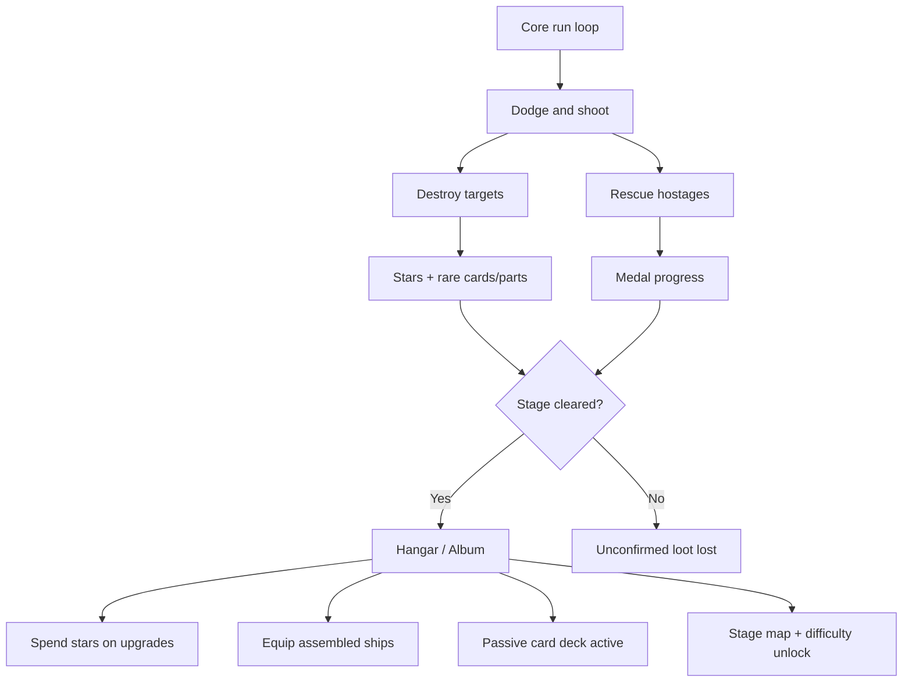

# Sky Force Reloaded (Browser) — Features & Design Reference

**Project:** `/Users/haimengzhou/apps/sky-force-reloaded`  
**Current version:** **0.6.0** (2026-06-07)  
**Reference game:** Infinite Dreams — *Sky Force Reloaded* (2016)  
**Stack:** Vanilla JS, Canvas 2D, classic scripts (works on `file://`), Tailwind CSS for UI chrome

This document is the **single reference** for what the game is, how it is designed, and what is implemented vs planned. Companion specs go deeper on math and wireframes:

| Doc | Focus |
|-----|-------|
| [GDD.md](./GDD.md) | Vision, core loop, content plan |
| [DRD.md](./DRD.md) | Five design pillars + acceptance criteria |
| [ECONOMY-SPEC.md](./ECONOMY-SPEC.md) | Star income formulas, hangar cost curves |
| [MECHANICS-DEPTH.md](./MECHANICS-DEPTH.md) | Future risk/reward layers (crates, technicians, gimmicks) |
| [UI-SPEC.md](./UI-SPEC.md) | Screen wireframes, tokens, DOM vs canvas |
| [INPUT-SPEC.md](./INPUT-SPEC.md) | Touch, keyboard, dilation, hitbox |
| [ARCHITECTURE.md](./ARCHITECTURE.md) | Module map, game loop, agent hooks |
| [ROADMAP.md](./ROADMAP.md) | Phased delivery history |

---

## 1. Vision

A browser vertical shoot-em-up that captures the **feel** of Sky Force Reloaded:

- Ship at the bottom third; **auto-fire**; player focuses on **dodge positioning**
- **Scrolling battlefield** with formations and set-piece boss fights
- **Stars** as persistent hangar currency; **in-run weapon pickups** as temporary spikes
- **Stage medals** and difficulty tiers driving replay

Not a pixel-perfect clone — same genre loop, web-first MVP with a documented path to deeper meta.

---

## 2. Design pillars (DRD)

| Pillar | Intent | v0.6 status |
|--------|--------|-------------|
| **Core gameplay** | Responsive movement, readable bullets, fair telegraph | ✓ + destructible targets |
| **Meta-progression** | Stars → hangar → replay stages | ✓ + cards, ship fleet, unconfirmed loot |
| **Level design** | JSON-driven stages, medals, objectives | ✓ + mid-run medal feedback |
| **Visual & audio** | Crunchy feedback | Partial — VFX/juice; no audio yet |
| **Technical** | Vanilla canvas, pools, agent-testable | ✓ `window.__SKY_FORCE__`, Playwright agent |

---

## 3. Game modes

### 3.1 Campaign (Stage mode)

- **Entry:** Title → **STAGES — CAMPAIGN** → Stage map → pick difficulty → **LAUNCH**
- **Director:** `StageDirector` reads `data/stages/stage-01.json` timeline (no random wave spawn during campaign)
- **Sections:** Scripted formations, banners, 2 hostages, stage boss at ~55s
- **Clear:** Boss kill → results overlay → stars banked to wallet
- **Death:** Game over; run stars **not** banked (mid-run quit same rule)

### 3.2 Arcade (Endless)

- **Entry:** Title → **ARCADE — ENDLESS**
- **Waves:** Kill quota per wave (`12` base, +4 cap 30); scroll speed +4 per wave
- **Boss:** Every **5 waves** — `WaveBoss` (~2450 HP scaled by wave), wave progress blocked while boss alive
- **Variety:** Diver swoops, elite golden fighters every 3 waves, wave/boss banners
- **No banking:** Arcade run stars shown on HUD but not persisted to hangar wallet on game over (campaign-only banking)

---

## 4. Navigation & screens



| Screen | ID | Implemented | Notes |
|--------|-----|-------------|-------|
| Title hub | S01 | ✓ | Shows banked ★; three CTAs |
| Hangar | S09 | ✓ | 8-module grid, upgrade buttons |
| Stage map | S02 | ✓ | Stage 1 only; difficulty + medals |
| In-game HUD | S04 | ✓ | Score, run stars, section/wave, lives, shield, weapon, combo, boss bar |
| Time dilation overlay | S06 | ✓ | Cyan ring + speed badge (20% Focus Time) |
| Ability bar | — | ✓ | Laser / Shield / Bomb charges |
| Game over | S08 | ✓ | Retry + menu |
| Stage clear | S07 | ✓ | Score, stars banked, medals |
| Pause | S05 | ✗ | Planned |
| Settings | S11 | ✗ | Planned |
| Stage briefing | S03 | ✗ | Optional stretch |

---

## 5. Player ship

### 5.1 Movement

| Property | Value |
|----------|-------|
| Logical canvas | 360 × 640 px |
| Speed | 220 px/s |
| Y bounds | 45% – 100% of canvas height |
| Visual radius | 14 px |
| **Hitbox radius** | **4 px** (center) |
| Touch | **Relative delta** — ship moves by finger delta, not teleport |
| Keyboard | WASD / arrows; full speed (no dilation while keys held) |

### 5.2 Defense

| Rule | Value |
|------|-------|
| Lives | 3 per run |
| Shield | Hangar HP sets `shieldMax`; empty shield → lose life |
| Invuln after hit | 1.5 s blink |
| Respawn invuln | 2 s |
| Energy shield ability | 3 s full invuln + shield refill |

### 5.3 Weapons

**Hangar baseline + in-run pickup** — effective pattern = `max(hangar cannon tier, weapon pickup level)`.

| Tier | Pattern | Source |
|------|---------|--------|
| 1 | Single forward bolt | Start / hangar L0–2 |
| 2 | Dual parallel | Pickup W or hangar L3–5 |
| 3 | Triple spread | Pickup or hangar L6–8 |
| 4 | Wide 5-shot + faster ROF | Pickup cap or hangar L9–10 |

**Hangar cannon** also adds DPS mult (`1 + level × 0.10`) and flat damage bonus (`floor(level × 0.8)`).

**Wing cannons** (hangar): side shots at L≥2 and L≥4 wing levels (`floor(wings/2)`).

**Homing missiles** (hangar): salvo `1 + floor(missiles/2)` on interval `max(1.2, 2.8 - missiles×0.15)` s.

### 5.4 Active abilities (per-sortie charges from hangar stocks)

| Ability | Key | Effect | Duration / area |
|---------|-----|--------|-----------------|
| **Laser** | Z | Vertical beam through ship X | 2.5 s; 80 DPS to enemies in column; 1.5× vs boss |
| **Energy shield** | X | Invuln + full shield | 3 s |
| **Mega bomb** | C | Clears enemy bullets; 55% max HP to all enemies; 20% boss HP | Instant |

Charges at run start = hangar stock levels (`laser`, `energy_shield`, `mega_bomb` modules).

### 5.5 Focus Time (time dilation)

| Parameter | Spec value | Design doc default |
|-----------|------------|-------------------|
| Trigger | Touch: pointer up ≥ 100 ms | Same |
| **Time scale** | **0.20 (20%)** | UI-SPEC said 25%; tuned slower in v0.5 |
| Keyboard | No dilation (full speed) | Same |
| UI | `#dilation-overlay` + speed badge | Same |

---

## 6. Enemies

### 6.1 Types

| Type | HP (base) | Behavior | Drops |
|------|-----------|----------|-------|
| **Scout** | 12 | Straight dive, light sway | 12% weapon |
| **Fighter** | 28 | Sway + aimed shots (1.8s) | 18% shield |
| **Tank** | 55 | Slow, high HP, fires (2.4s) | 25% weapon |
| **Diver** | 16 | Swoop with horizontal velocity | 22% weapon |

Wave scaling: `hp += wave×4`, `speed += wave×3`. Stage mode applies difficulty HP mult from hangar config.

**Elite:** Golden variant — ×1.85 HP, ×1.6 points, guaranteed drop. Arcade: every 3 waves. Stage: scripted spawns.

**Visual damage:** Enemies show wear at ≤50% and ≤25% HP (smoke tint).

### 6.2 Arcade-only spawning

Random formations when not in stage mode: lines, V, pincer, diver groups, elite inserts.

### 6.3 Stage 1 timeline (summary)

| Time | Event |
|------|-------|
| 0s | Banner "SECTOR 07", section 1 |
| 3s | 4× scout line |
| 12s | "HOSTILE FIGHTERS", 2× fighter |
| 18s | Hostage **h1** at (32%, 62%) |
| 22s | Elite scout |
| 28s | "DIVE SQUADRON", 4× diver |
| 38s | Hostage **h2** at (68%, 58%) |
| 40s | 2× fighter + tank |
| 52s | "BOSS INCOMING", section 4 |
| 55s | Boss **DEBRIS CORE** (4200 HP) |

Full script: `data/stages/stage-01.json`.

---

## 7. Boss design — Debris Core

Single-entity boss (`js/boss.js` — `WaveBoss`).

| Context | HP | Fire scale | TTK target |
|---------|-----|------------|------------|
| **Stage boss** | 4200 | 1.1× | ~12–15 s at weapon Lv 3 |
| **Arcade wave-5+** | ~2450 (2000 + wave×90) | 1.0× | Similar pacing |

### Phases

| Phase | Trigger | Patterns |
|-------|---------|----------|
| **1** | 100% → 50% HP | 7-bullet aimed fan, ~0.95s interval |
| **2** | ≤50% HP | 10-arm spiral + aimed stream; ~0.48s interval; red rage flash telegraph |

Defeat drops: score burst, star entities, weapon + shield pickups; stage boss triggers clear flow.

**Not yet:** Modular wings/core, aim-laser telegraph (see MECHANICS-DEPTH).

---

## 8. Pickups, stars & scoring

### 8.1 In-run entities

| Entity | Effect |
|--------|--------|
| Star | +score; run star counter += `max(1, value/10)` |
| Weapon (W) | +1 weapon level (cap 4) |
| Shield (S) | Refill shield to 100% |
| Magnet (passive) | Hangar stat — vacuum in radius |

### 8.2 Combo

- Increments on kills; decays after **3 s** without kill
- Score multiplier scales with combo (HUD shows `×N`)
- Design spec also defines star combo cap ×2 and chain-break on escape — **partially implemented** in economy JSON; escape penalty not wired in v0.5

### 8.3 Stage star banking (on clear)

```
banked = round(runStars × difficultyStarMult)
       + medalsEarned × 100
       + rescuedHostages × 50
```

| Difficulty | Star mult | Enemy HP | Bullet speed |
|------------|-----------|----------|--------------|
| Normal | 1.0 | 1.0 | 1.0 |
| Hard | 1.3 | 1.25 | 1.12 |
| Insane | 1.55 | 1.5 | 1.28 |
| Nightmare | 1.75 | 1.85 | 1.45 |

Clear bonus from stage JSON: +50★ (Stage 1).

**Balance anchor:** ~1,900★ average Stage 1 Normal clear (see ECONOMY-SPEC).

---

## 9. Hangar & economy

**Profile:** `heavy-grind` — full hangar ~**101,595★** (~54 average clears); MVP trio (HP + cannon + magnet) ~**29,490★**.

**Cost formula:** `round5(base × growth^level)`; first purchase of locked module adds **unlock** fee.

### 9.1 Modules (8)

| Module | Unlock | Max Lv | Effect |
|--------|--------|--------|--------|
| **HP / Shield** | 0 | 10 | `shieldMax = 100 + level×15` |
| **Main cannon** | 0 | 10 | DPS mult, pattern tier every 3 levels, damage bonus |
| **Star magnet** | 2,000★ | 10 | Radius `40+level×12`, pull `100+level×30` |
| **Wing cannons** | 6,000★ | 10 | Side shots `floor(level/2)` |
| **Homing missiles** | 7,000★ | 8 | Salvo + faster interval |
| **Laser stock** | 6,000★ | 6 | Pre-stage laser charges |
| **Energy shield stock** | 6,000★ | 6 | Pre-stage shield charges |
| **Mega bomb stock** | 6,000★ | 6 | Pre-stage bomb charges |

**Recommended upgrade order:** HP → Cannon → Magnet → Wings → Missiles → ability stocks.

Data: `data/economy/hangar.json` + runtime mirror `js/economy/hangar-data.js` (`window.HANGAR_CONFIG`).

---

## 10. Medals & difficulty

Four medals per stage **per difficulty tier**. Earn all four on tier N → unlock tier N+1.

| Medal ID | Label | Condition (implemented) |
|----------|-------|---------------------------|
| `destroy70` | 70% Annihilation | Kill ≥70% of spawned enemies |
| `destroy100` | 100% Annihilation | Kill 100% of spawned |
| `rescueAll` | Rescue All | All hostages rescued |
| `noHit` | Untouched | `runHits === 0` (no shield damage) |

Difficulty chain: **Normal → Hard → Insane → Nightmare**.

Medals persist in save per `(stageId, difficulty)`.

---

## 11. Hostages

- **Rescue:** Stay within ~34 px of pod for **2.5 s** (progress ring)
- **Break channel:** Leave radius → progress decays at 0.5× fill rate
- **Reward per rescue:** +5 run stars, +200 score
- **Medal:** All spawned hostages rescued
- **UI:** "HELP!" bubble; no sassy scramble speech yet (MECHANICS-DEPTH)

Stage 1: 2 hostages at 18s and 38s.

---

## 12. Friend checkpoint (stub)

On stage runs, when score crosses `friendCheckpointScore` (default **42,000**), a side marker **"FRIEND 42k"** turns green and banner fires.

**Not yet:** Real async leaderboard / wreckage rescue at friend death coordinates.

---

## 13. Persistence

**Key:** `sky-force-reloaded-v1` (localStorage)

```javascript
{
  bankedStars: 0,
  hangar: { hp: 0, cannon: 0, ... },
  hangarUnlockPaid: { magnet: true, ... },
  unlockedStages: [1],
  stageClears: { "1": { score, difficulty, at } },
  stageMedals: { "1": { normal: ["destroy70", ...], hard: [] } },
  highScore: 0,
  friendCheckpointScore: 42000
}
```

---

## 14. UI / visual design

### 14.1 Style

- **Neon vector** on dark cosmic parallax (CSS starfield + canvas layers)
- **Fonts:** Orbitron (titles), Rajdhani (HUD)
- **Palette:** Cyan accents, amber stars/score, rose lives/danger, emerald shield

### 14.2 HUD elements

- Top bar: logo, score, run stars, wave/section, hearts
- Boss bar: name + HP % (DOM, above canvas)
- Bottom: shield bar, weapon level, combo (hidden at ×1)
- Banners: stage / wave / boss / clear toasts
- Hit flash toast, screen shake on damage

See **UI-SPEC.md** for wireframes and token table.

---

## 15. AI agent & testing

**Path:** `ai-agent/agent.js` (Playwright + heuristic or LLM)

```bash
cd /Users/haimengzhou/apps/sky-force-reloaded
node ai-agent/agent.js --heuristic --headless --turns 80 --tick 500
```

| Feature | Detail |
|---------|--------|
| Entry | Clicks `#btn-arcade` |
| State API | `window.__SKY_FORCE__.getState()` |
| Heuristic | Bullet dodge, enemy ram avoid, boss mode, pickup seeking |
| Logs | `ai-agent/logs/run-*.jsonl` |
| Tuner | `ai-agent/lib/tuner.js` + `agent-config.json` |

Also: `__SKY_FORCE__.startArcade()`, `.startStage1(difficulty)`.

---

## 16. Project layout

```
sky-force-reloaded/
├── sky_force_reloaded.html      # Entry
├── css/ui.css                   # HUD, hangar, overlays
├── data/
│   ├── economy/hangar.json
│   └── stages/stage-01.json
├── docs/                        # Design specs (this file + GDD, DRD, …)
├── js/
│   ├── main.js                  # UI, menus, callbacks
│   ├── game.js                  # Loop, modes, medals, abilities
│   ├── player.js
│   ├── enemies.js
│   ├── bullets.js               # Pools + homing missiles
│   ├── boss.js
│   ├── stars.js                 # Pickups + magnet vacuum
│   ├── hostages.js
│   ├── hangar.js
│   ├── save.js
│   ├── stage-director.js
│   ├── stages/stage-01.js       # Loads JSON → window.SKY_FORCE_STAGES
│   └── economy/hangar-data.js
├── ai-agent/
└── CHANGELOG.md
```

---

---

## 21. Collection album (v0.6)

Sky Force’s **high-stakes loot** loop — cards drop mid-run but only bank if you clear the stage.

### Drop sources

| Source | Card rate | Part rate |
|--------|-----------|-----------|
| Elite enemy kill | 8% × luck | 6% × luck |
| Cargo crate destroy | 12% × luck | — |
| Radar / fuel tower | — | 5% × luck |

**Luck mult:** ship (Ace ×1.35) × card #10 (+12%) × other passives.

### High-stakes rule

1. Pickup adds to `runUnconfirmed` in save (shown in HUD slide + Album as “unconfirmed”).
2. **Death / fail** → `discardRunLoot()` — cards/parts lost.
3. **Stage clear** → `confirmRunLoot()` — moved to permanent `collection`.

### Permanent cards (12 / album slots #01–#12)

Examples: +10% magnet, −10% cannon upgrade cost, start at full shield, +5% banked stars, combo decay slower, +6% cannon ROF, rescue score bonus, +1 bomb charge, +50★ on perfect medal.

Passives stack multiplicatively where noted in `js/economy/collection-data.js`.

### Temporary cards (stretch hook)

`Overdrive` (2× damage 15 min), `Star Rush` (2× star pickups 10 min) — schema ready; drops not wired in v0.6.

---

## 22. Fleet hangar (v0.6)

Part-gated ships — collect **weapon + wing + engine** from runs to unlock.

| Ship | Playstyle | Modifiers |
|------|-----------|-----------|
| **Enforcer** | Starter balanced | defaults |
| **Gladius** | Fast, fragile | +28% speed, −18% shield |
| **Octopus** | Missile swarm | wing guns → extra homing salvos |
| **Iron Clad** | Tank | +45% shield, −28% speed, −40% ram damage |
| **Ace of Spades** | Farmer | +35% card/part drop luck |

Equip in **Hangar → FLEET**; launch button shows active ship.

---

## 23. Destructible targets (v0.6)

Non-shooting targets break pacing and feed resources.

| Type | HP | On destroy |
|------|-----|------------|
| **Crate** | 18 | W/S pickups, star cluster, card roll |
| **Radar** | 120 | Star fountain (14×22★), part roll |
| **Fuel tank** | 90 | Same profile as radar |

Scroll with the map layer. Stage 1 places crates early, radar mid, fuel pre-boss. Arcade spawns crates periodically (+ radar from wave 3).

---

## 24. Mid-run medal feedback (v0.6)

| UI | Behavior |
|----|----------|
| **Medal chip row** | Top of playfield during campaign — 70% / 100% / Rescue / Perfect |
| **Earn banner** | Slides in from right: `✦ 70% Hostiles Destroyed`, etc. |
| **Perfect crack** | First shield hit → chip strikethrough + red crack overlay + fail banner |
| **Loot banner** | `CARD:` / `PART:` on unconfirmed pickup |

---

## 25. Architecture loops (complete)



---

## 17. Implemented vs planned

| Feature | Status | Target doc |
|---------|--------|------------|
| Relative touch + auto-fire | ✓ v0.2 | INPUT-SPEC |
| Star entities + combo | ✓ v0.2 | GDD |
| Stage 1 JSON campaign | ✓ v0.4 | ARCHITECTURE |
| Wave boss (arcade) | ✓ v0.3.4 | GDD |
| Hangar 8 modules | ✓ v0.5 | ECONOMY-SPEC |
| Medals + 4 difficulties | ✓ v0.5 | DRD |
| Hostages | ✓ v0.5 | MECHANICS-DEPTH |
| Active abilities Z/X/C | ✓ v0.5 | GDD |
| Magnet + missiles + wings | ✓ v0.5 | ECONOMY-SPEC |
| Focus Time 20% | ✓ v0.5 | INPUT-SPEC |
| Playwright agent | ✓ v0.3+ | ARCHITECTURE |
| Card collection + unconfirmed loot | ✓ v0.6 | §21 |
| Ship fleet + parts | ✓ v0.6 | §22 |
| Destructible crates/towers | ✓ v0.6 | §23 |
| Mid-run medal banners | ✓ v0.6 | §24 |
| Stage 2–3 | ✗ | GDD §8 |
| Pause menu | ✗ | UI-SPEC S05 |
| Settings / audio | ✗ | ROADMAP |
| Chain break on escape | ✗ | MECHANICS-DEPTH |
| Escort crate | ✗ | MECHANICS-DEPTH |
| Technicians / ships | ✗ | MECHANICS-DEPTH |
| EMP / darkness stages | ✗ | MECHANICS-DEPTH |
| Modular multi-part boss | ✗ | MECHANICS-DEPTH |
| Real friend leaderboard | ✗ | MECHANICS-DEPTH |
| Turret enemy (dedicated type) | ✗ | GDD |

---

## 18. Controls quick reference

| Input | Action |
|-------|--------|
| Touch drag | Move ship (relative) |
| Auto | Fire always while playing |
| `←→↑↓` / WASD | Move (desktop) |
| `Space` | Fire (redundant) |
| `Z` | Laser |
| `X` | Energy shield |
| `C` | Mega bomb |
| Lift finger (mobile) | Focus Time slow-mo |

---

## 19. Play

```bash
# Option A — double-click sky_force_reloaded.html

# Option B — local server
cd /Users/haimengzhou/apps/sky-force-reloaded
python3 -m http.server 8766
# → http://localhost:8766/sky_force_reloaded.html
```

---

## 20. Version history

See **[CHANGELOG.md](../CHANGELOG.md)** for release notes. Major milestones:

| Version | Theme |
|---------|-------|
| 0.1 | Canvas scaffold, enemies, power-ups |
| 0.2 | Feel polish — touch, stars, combo, hitbox |
| 0.3 | Vivid UI, agent, wave bosses, divers |
| 0.4 | Stage 1 + stage select + star banking |
| 0.5 | Hangar, medals, hostages, abilities, full meta loop |
| 0.6 | Cards, fleet, destructibles, mid-run medal UX |

---

*Last updated: 2026-06-07 · reflects v0.6.0*
