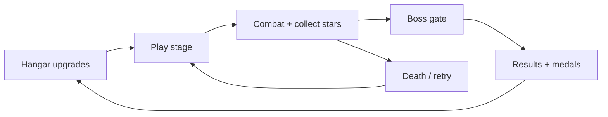

# Game Design Document — Sky Force Reloaded (Browser)

**Project:** `sky-force-reloaded`  
**Reference:** Infinite Dreams — *Sky Force Reloaded* (2016)  
**Target fidelity:** **Inspired-by MVP** with a documented path to closer mimic (stages, hangar meta, medals)  
**Platform:** Mobile-first portrait + desktop keyboard  
**Stack:** Vanilla JS, Canvas 2D, ES modules (no build step for MVP)

---

## 1. Vision

A browser vertical shoot-em-up that captures the **feel** of Sky Force Reloaded:

- Ship at the bottom third, **auto-fire forward**, player focuses on **dodge positioning**
- **Scrolling battlefield** with dense enemy formations and set-piece boss fights
- **Stars** as persistent currency; **in-run weapon upgrades** as temporary power spikes
- **Stage medals** (optional objectives) driving replay and difficulty unlocks

Not a pixel-perfect clone — same genre loop, simplified meta for web MVP.

---

## 2. Core Loop

| Phase | Player action | Reward |
|-------|---------------|--------|
| **Hangar** | Spend stars on HP, main cannon, wing guns, magnet, bombs | Permanent power |
| **Stage** | Dodge, collect drops, rescue survivors (stretch) | Stars, score, medals |
| **Boss** | Pattern recognition, burst DPS | Stage clear, bonus stars |
| **Results** | Review medals, retry for perfection | Unlock next stage / difficulty |

**MVP loop (v0.5):** Title hub → Hangar / Stage select / Arcade → combat → boss → results → bank stars → upgrade hangar. Medals unlock Hard → Insane → Nightmare.

> **Implementation reference:** see **`docs/FEATURES-AND-DESIGN.md`** for current v0.5 behavior.

---

## 3. Reference Mechanics (Sky Force Reloaded)

| System | Original | Our game (v0.5) | Stretch |
|--------|----------|-----------------|---------|
| Stages | 16 fixed stages + bonus | Stage 1 campaign + Arcade | 8+ stages |
| Planes | 9 unlockable | 1 starter ship | 3 ships |
| Auto-fire | Always on | ✓ Always on | Supercharge charge shot |
| Manual power-ups | Laser, shield, mega bomb | ✓ Z/X/C + hangar stocks | Cooldown UI polish |
| In-run upgrades | Weapon upgrade pickups | ✓ W pickup → level 1–4 + hangar pattern | Separate fire-rate track |
| Currency | Stars (persistent) | ✓ Banked on stage clear | Pre-stage consumables |
| Hangar | 10-tier upgrades per module | ✓ 8 modules, heavy-grind curve | Cards |
| Medals | 4 objectives per stage | ✓ 4 medals × 4 difficulties | Time/score medals |
| Difficulty | Normal → Premium → Nightmare | ✓ Normal → Hard → Insane → Nightmare | — |
| Technicians / Cards | Meta modifiers | — | v0.9–v1.0 ([[MECHANICS-DEPTH]]) |
| Escort crate / wreckage | Rogue-lite mid-level events | — | v1.0+ |
| Gimmick stages (EMP, darkness) | Pacing breaks | — | v1.0–v1.1 |
| Modular bosses | Part destruction order | Single HP bar | v0.5 → v0.9 parts |
| Co-op | Local 2P | — | Out of scope |

Sources: [Sky Force Reloaded Wiki](https://sky-force-reloaded-2016.fandom.com/wiki/Sky_Force_Reloaded), [EGM review](https://egmnow.com/sky-force-reloaded-review/).

---

## 4. Player Ship

### 4.1 Movement

- **Portrait playfield:** 9:16 logical canvas (360×640), scaled to viewport
- **Bounds:** Ship stays in lower ~55% of screen (Sky Force style — dodge space above)
- **Input:**
  - Touch: drag to position, **auto-fire while finger down**
  - Keyboard: WASD/arrows move, Space = fire (hold)
- **Speed:** ~220 px/s base; no inertia (arcade snappy)

### 4.2 Weapons (MVP)

| Level | Pattern | Unlock |
|-------|---------|--------|
| 1 | Single forward bolt | Start |
| 2 | Dual parallel | `W` pickup or hangar |
| 3 | Triple spread | pickup / hangar |
| 4 | Wide spread + faster ROF | pickup cap |

**Stretch:** Homing missiles (secondary slot), laser sweep (manual, limited duration).

### 4.3 Defense

- **Shield bar** (not lives-first): damage depletes shield; empty shield → life lost
- **3 lives** per run (arcade default)
- **Invulnerability:** 2s after respawn with blink VFX

### 4.4 Manual abilities (post-MVP)

| Ability | Effect | Cooldown |
|---------|--------|----------|
| Energy shield | Full invuln 3s | 1 per stage |
| Mega bomb | Clear bullets + AoE damage | 1 per stage |
| Laser | Piercing beam | 8s cooldown |

---

## 5. Enemies

### 5.1 Archetypes (v0.1 implemented → expand)

| Type | Behavior | HP scale | Drops |
|------|----------|----------|-------|
| **Scout** | Straight dive, light sway | Low | Stars, occasional `W` |
| **Fighter** | Sway + aimed shots | Medium | Stars, `S` shield |
| **Tank** | Slow, high HP | High | Stars, `W` |
| **Turret** (new) | Fixed position, burst fire | Medium | Stars |
| **Formation leader** (new) | Spawns wingmen on death | Medium | Bonus stars |

### 5.2 Spawning

- **Scripted waves** per stage section (not pure random)
- Formations: line, V, pincer, ring around boss
- Difficulty scales: `hp += wave * 4`, `fireRate -= wave * 0.05`

### 5.3 Bosses

Each stage ends with a **multi-phase boss**:

1. **Phase A:** Bullet patterns (fan, spiral, aimed streams)
2. **Phase B:** 50% HP — faster patterns + adds
3. **Phase C:** 25% HP — enrage (screen fill danger zones)

**MVP boss (v0.5):** Single large entity, 2 phases.

**Modular boss (v0.9+):** Destroy wing cannons → crack armor plate → expose core; orbital railgun with aim-laser telegraph. See [[MECHANICS-DEPTH#4 Multi-Part Flanking Bosses]].

---

## 6. Pickups & Economy

### 6.1 In-run pickups

| Pickup | Effect | Visual |
|--------|--------|--------|
| Star | +10 score (MVP); +1 star currency (v0.4) | Yellow sparkle |
| Weapon (`W`) | +1 weapon level (cap 4) | Purple orb |
| Shield (`S`) | Refill shield to 100% | Green orb |
| Health (`H`) | +1 life (rare) | Orange heart |
| Magnet (passive hangar) | Pull stars in radius | — |

### 6.2 Persistent economy (v0.6+)

- Stars banked at stage end (lost on mid-stage quit)
- Hangar upgrade tree (10 blocks per module, shared across ships)
- Priority unlock order: **HP → Main cannon → Magnet → Wing cannons → Missiles**
- **Cost formula & pacing:** see **`docs/ECONOMY-SPEC.md`** (heavy-grind profile: ~29.5k★ MVP max ≈16 clears, ~102k★ full hangar ≈54 clears, ~1.9k★ per average Stage 1 clear)

### 6.3 Risk/reward layers (v0.9+)

Full spec: **`docs/MECHANICS-DEPTH.md`**

| Layer | Hook |
|-------|------|
| Escort crate | Magnet heavy cargo through bullet hell → permanent card |
| Wreckage rescue | Hover on leaderboard death spot → 500★ burst |
| Technicians | Slo-Mo Chan, Kate Brush, Holo Granny — rule changes, not just stats |
| Gimmick stages | EMP (no guns), darkness (headlamp only) |
| Modular bosses | Wings → plate → core; aim-laser telegraph |
| Chain break | Escaping enemy resets combo — forces aggressive pursuit |

---

## 7. Scoring & Medals

### Score

- Enemy kill points × combo multiplier
- Combo decays after 3s without kill; **resets instantly** if an enemy escapes the screen undamaged (see [[MECHANICS-DEPTH#5.2 Multiplier chain]])
- Stage clear bonus + unused lives bonus

### Medals (stretch, per stage)

| Medal | Condition |
|-------|-----------|
| Completion | Finish stage |
| No damage | Never lose shield |
| Rescue | Collect all survivor pods |
| Ace | Score ≥ threshold |

Medals unlock next stage and higher difficulty.

---

## 8. Stages (MVP content plan)

| Stage | Theme | Boss | New mechanic |
|-------|-------|------|--------------|
| **1 — Orbital debris** | Asteroid field parallax | Debris core | Basic formations |
| **2 — Fleet assault** | Enemy capitals | Dreadnought | Turrets + aimed fire |
| **3 — Orbital fortress** | Station exterior | Command tower | Bullet hell patterns |

Endless mode (current v0.1 wave system) remains as **Arcade** side mode.

---

## 9. UX / Screens

| Screen | MVP | Notes |
|--------|-----|-------|
| Title | ✓ (overlay) | LAUNCH button |
| HUD | ✓ partial | Add star count, combo, boss bar |
| Pause | — | v0.3 |
| Hangar | — | v0.6 |
| Stage select | — | v0.4 |
| Results | partial | Game over only; add stage clear |
| Settings | — | SFX volume, control scheme |

Full screen map, tokens, and wireframes: **`docs/UI-SPEC.md`**

**Visual style:** Neon vector on dark parallax (current prototype). Placeholder geometry until sprite pipeline exists.

**Audio:** Silent through v0.5; Web Audio API SFX in v0.6, music loop v0.7.

---

## 10. v0.5 Implementation Status

| Feature | Status |
|---------|--------|
| Canvas game loop | ✓ |
| Relative touch + 4px hitbox + Focus Time | ✓ |
| Always-on auto-fire | ✓ |
| Star entities + combo | ✓ |
| Stage 1 JSON campaign + StageDirector | ✓ |
| Arcade endless + wave-5 bosses | ✓ |
| Hangar 8 modules + star banking | ✓ |
| Medals + 4 difficulty tiers | ✓ |
| Hostages + rescue meter | ✓ |
| Active abilities (laser/shield/bomb) | ✓ |
| Playwright agent + getState | ✓ |
| Stage 2+ | ✗ |
| Pause / settings / audio | ✗ |
| Chain-break combo on escape | ✗ |
| Technicians, crates, gimmick stages | ✗ |

Full detail: **`docs/FEATURES-AND-DESIGN.md`**

---

## 11. Design Principles

1. **Readable bullets** — enemy projectiles use distinct color/size; never faster than dodgeable at 60fps
2. **Fair telegraph** — boss patterns announce 0.5s before lethal density
3. **Mobile thumb zone** — UI clear of bottom 20% on phones
4. **Compilable sessions** — stage ≤ 5 min; endless for score chasers
5. **Agent-testable** — expose `window.__GAME_STATE__` for Playwright (see ARCHITECTURE.md)

---

## 12. Out of Scope (v1.0 MVP)

- Online tournaments
- Local co-op
- All 9 planes (ship roster is v1.0 stretch, not day-one)
- Native mobile wrapper (Capacitor) — consider post-web polish

**In scope post-MVP (v0.9–v1.2):** technicians, escort crates, gimmick stages, async wreckage — see [[MECHANICS-DEPTH]] and [[ROADMAP]].

---

## 13. Open Questions (defaults applied)

| Question | Default for this design |
|----------|-------------------------|
| Fidelity | Inspired MVP → staged path to hangar/medals |
| Tech | Stay vanilla canvas + ES modules |
| Platform | Mobile-first portrait + keyboard |
| Art | Neon vector placeholders |
| Audio | Deferred |
| AI agent | Phase v0.7 per ROADMAP |

---

*Last updated: 2026-06-07*
