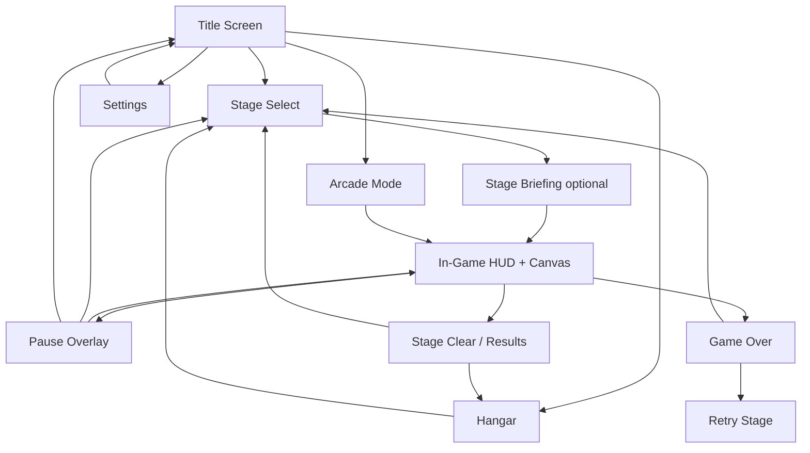

# UI Specification — Sky Force Reloaded (Browser)

**Project:** `sky-force-reloaded`  
**Platform:** Browser-first, mobile portrait primary, desktop secondary  
**Stack:** HTML + CSS (Tailwind) for all UI · Canvas 2D for gameplay only  
**Companion docs:** `GDD.md`, `DRD.md`, `ARCHITECTURE.md`, `ROADMAP.md`

---

## 1. UI principles

1. **DOM for chrome, canvas for combat** — Never draw hangar buttons or medal lists on the canvas.
2. **Thumb-first** — Primary actions and power-ups live in reachable edge zones; HUD stays thin.
3. **Read under fire** — HUD uses high contrast, no tiny text; critical stats visible in peripheral vision.
4. **One logical viewport** — Game canvas is always 9:16 (360×640 logical); UI shell letterboxes on widescreen.
5. **Pause-friendly** — Time dilation and pause overlays are HTML so they remain crisp while the game slows.
6. **Progressive disclosure** — Hangar shows one upgrade module at a time on narrow phones; full grid on tablet/desktop.

---

## 2. DOM vs canvas split

| Element | Layer | Rationale |
|---------|-------|-----------|
| Ship, enemies, bullets, explosions | **Canvas** | Moves with world coordinates |
| Boss telegraph lines, aim lasers | **Canvas** | Must align to game space |
| Star/pickup entities (visual) | **Canvas** | Collision + motion |
| Top HUD (score, wave, lives) | **DOM** | Fixed screen space |
| Bottom stats (shield %, weapon lv) | **DOM** | Fixed screen space |
| Boss HP bar | **DOM** | Wide bar above canvas; easier to animate |
| Power-up buttons (Shield / Laser / Bomb) | **DOM** | Large touch targets, edge-fixed |
| Pause / time-dilation overlay | **DOM** | Dim + menu while canvas slows |
| Title, stage select, hangar, results | **DOM** | Full-screen HTML screens |
| Toast / banner (“STAGE 1”) | **DOM** | Temporary overlay on canvas area |
| Settings, modals | **DOM** | Standard form controls |

---

## 3. Screen map & navigation



### Screen inventory

| ID | Screen | Priority | ROADMAP phase |
|----|--------|----------|---------------|
| `S01` | Title | MVP | v0.1 ✓ (partial) |
| `S02` | Stage select | High | v0.4 |
| `S03` | Stage briefing | Low | v0.5 |
| `S04` | In-game HUD | High | v0.2 polish |
| `S05` | Pause | Medium | v0.3 |
| `S06` | Time dilation overlay | Medium | v0.3 |
| `S07` | Stage clear / results | High | v0.4 |
| `S08` | Game over | MVP | v0.1 ✓ |
| `S09` | Hangar | High | v0.6 |
| `S10` | Medals detail | Medium | v0.8 |
| `S11` | Settings | Low | v0.6 |
| `S12` | Arcade mode entry | Medium | v0.4 |

---

## 4. Layout shell

All screens share a common **Game Shell** except full-page meta screens (Hangar, Settings).

```
┌─────────────────────────────────────────────── viewport (any aspect)
│  ░░░░░░░░░ letterbox (bg-slate-950) ░░░░░░░░░ │
│  ┌─────────────────────────────────────────┐ │
│  │  TOP HUD BAR (DOM, h: 48–56px)          │ │
│  ├─────────────────────────────────────────┤ │
│  │ L │                                 │ R │ │
│  │ E │      CANVAS 9:16 (360×640)      │ I │ │
│  │ F │      gameplay only              │ G │ │
│  │ T │                                 │ H │ │
│  │   │                                 │ T │ │
│  │ P │                                 │   │ │
│  │ U │                                 │ P │ │
│  │   │                                 │ U │ │
│  │ B │                                 │ B │ │
│  │ T │                                 │ T │ │
│  │ N │                                 │ N │ │
│  ├─────────────────────────────────────────┤ │
│  │  BOTTOM STRIP (DOM, h: 32–40px)         │ │
│  └─────────────────────────────────────────┘ │
│  ░░░░░░░░░ letterbox ░░░░░░░░░░░░░░░░░░░░░░ │
└───────────────────────────────────────────────
```

### Safe zones (portrait phone)

| Zone | % of shell height | Content |
|------|-------------------|---------|
| Top HUD | 8–10% | Score, stars, wave, lives |
| Play area | 72–78% | Canvas (ship in lower 55% of *canvas*, not shell) |
| Bottom strip | 6–8% | Shield %, weapon level, combo |
| Left edge column | 56px min width | Power-up stack (optional collapse) |
| Right edge column | 48px | Pause button |

**Rule:** No critical canvas action under fixed DOM buttons — ship movement clamp stays inside canvas inset.

---

## 5. Design tokens

### Typography

| Role | Font | Size (mobile) | Weight |
|------|------|---------------|--------|
| Logo / stage title | Orbitron | 28–40px | 900 |
| HUD labels | Rajdhani | 10–12px | 600, uppercase, tracking-wider |
| HUD values | Rajdhani | 16–20px | 700 |
| Body / menus | Rajdhani | 14–16px | 500 |
| Button CTA | Orbitron | 14–16px | 700 |

### Color palette

| Token | Hex | Use |
|-------|-----|-----|
| `bg-deep` | `#020617` | Page background, letterbox |
| `bg-panel` | `#0f172a` | Cards, hangar modules |
| `border-subtle` | `#1e293b` | Panel borders |
| `accent-cyan` | `#22d3ee` | Primary actions, wave indicator |
| `accent-amber` | `#fbbf24` | Score, stars |
| `accent-rose` | `#fb7185` | Lives, danger |
| `accent-emerald` | `#34d399` | Shield, success |
| `accent-violet` | `#a78bfa` | Weapon level, upgrades |
| `text-muted` | `#94a3b8` | Secondary copy |

### Components (CSS / Tailwind patterns)

| Component | Description |
|-----------|-------------|
| `Panel` | `bg-slate-900/80 backdrop-blur border border-slate-800 rounded-xl p-4` |
| `StatChip` | Icon + label + value (current HUD pattern) |
| `BtnPrimary` | Cyan→indigo gradient, slate-950 text, Orbitron |
| `BtnSecondary` | Slate outline, hover brighten |
| `BtnDanger` | Rose→orange gradient (retry) |
| `ProgressBar` | 4px track; fill cyan/emerald/rose by context |
| `MedalIcon` | 48px circle; locked=grayscale, earned=full color + glow |
| `UpgradeBlock` | 10-segment bar; filled segments = purchased tiers |
| `Toast` | Top of canvas area, 2.5s auto-dismiss |

---

## 6. Screen specifications

### S01 — Title

**Purpose:** Entry point; establish brand; route to modes.

| Region | Content |
|--------|---------|
| Center | Logo “SKY FORCE”, subtitle, version |
| Primary CTA | **CAMPAIGN** → Stage select |
| Secondary | **ARCADE** → endless mode |
| Tertiary row | **HANGAR** · **SETTINGS** |
| Footer | Star balance (when meta exists): “★ 12,450” |

**States:** First launch (no save) hides star balance.  
**Animation:** Subtle parallax starfield in CSS background (not canvas) — optional.

---

### S02 — Stage select

**Purpose:** Pick stage + difficulty; show medal progress.

**Layout:** Vertical scroll list of stage cards (3 MVP, expandable).

**Stage card (each row):**

```
┌──────────────────────────────────────┐
│  [thumb 16:9]  STAGE 1              │
│                Orbital Debris        │
│                ★★★☆  medals 3/4      │
│                [NORMAL ▾]  [PLAY ▶]  │
└──────────────────────────────────────┘
```

| Field | Behavior |
|-------|----------|
| Thumbnail | Static stage art or themed gradient |
| Medals | 4 icons: Complete, 70%, 100%, No damage, Rescue — MVP uses subset |
| Difficulty | Locked until all medals on prior tier; Normal → Hard → Insane → Nightmare |
| Play | Loads stage JSON, transitions to in-game |
| Lock | Gray card + “Complete Stage N” if locked |

**Desktop:** Grid 2 columns if width > 640px.

---

### S04 — In-game HUD

**Purpose:** Always-visible run state; zero gameplay blocking.

#### Top bar (left → right)

| Slot | Content | Color |
|------|---------|-------|
| Logo mini | “SKY FORCE” truncated on narrow | cyan |
| Score | `SCORE 12,400` | amber |
| Stars (run) | `★ 87` collected this run | amber |
| Wave / Stage | `WAVE 3` or `STAGE 1` | cyan |
| Lives | `♥ 3` or ship icons | rose |

#### Boss bar (conditional)

- Hidden until boss active.
- Full width below top bar: name + `% HP` + wide progress bar.
- Phase change: bar flash + 500ms CSS pulse.

#### Bottom strip

| Slot | Content |
|------|---------|
| Shield | `SHIELD 73%` + thin bar |
| Weapon | `WEAPON LV 3` |
| Combo | `COMBO ×4.2` (hidden at ×1) |

#### Edge power-ups (v0.8+)

| Button | Position | Size | State |
|--------|----------|------|-------|
| Shield | Left stack, bottom | 48×48 min | Ready / active / cooldown overlay |
| Laser | Left stack, mid | 48×48 | Same |
| Megabomb | Left stack, top | 48×48 | Same |

Cooldown: radial wipe overlay + seconds text.  
**Desktop:** Same layout; keyboard shortcuts `Z` `X` `C` with tooltip on hover.

#### Pause control

- Top-right: `⏸` 44×44 touch target.
- Opens S05.

---

### S05 — Pause overlay

**Purpose:** Break without losing context.

| Element | Behavior |
|---------|----------|
| Backdrop | `bg-slate-950/85` over canvas + HUD dimmed |
| Panel center | PAUSED title |
| Actions | **RESUME** · **RESTART STAGE** · **QUIT TO MAP** |
| Settings shortcut | Mute toggle inline |

Game simulation paused (`game.running = false`); DOM remains interactive.

---

### S06 — Time dilation overlay (finger-up)

**Purpose:** Sky Force tactical pause — slow game, keep visibility.

| Behavior | Spec |
|----------|------|
| Trigger | Pointer up / no movement input for 100ms (not full pause menu) |
| Time scale | Game `dt × 0.25` (design default; tunable) |
| Visual | Thin cyan border pulse on canvas; optional “SLOW” micro-label |
| UI | Power-up buttons brighten; rest of HUD unchanged |
| Exit | Touch/move again → full speed |

**Not** the same as S05 — no modal; player still sees the battlefield.

---

### S07 — Stage clear / results

**Purpose:** Reward run; surface medals; drive hangar loop.

```
┌─────────────────────────────────┐
│      STAGE CLEAR                │
│      Orbital Debris             │
├─────────────────────────────────┤
│  Score     124,500              │
│  Stars     +340 ★               │
│  Time      4:32                 │
├─────────────────────────────────┤
│  MEDALS                         │
│  [✓ Complete]  [✓ 70% kills]    │
│  [✗ No damage] [✓ Rescue]       │
├─────────────────────────────────┤
│  [HANGAR]  [NEXT STAGE]  [RETRY]│
└─────────────────────────────────┘
```

| Rule | Detail |
|------|--------|
| Stars | Banked to persistent total on this screen |
| Card drops | Shown here if survived stage (stretch) |
| Next stage | Disabled if not unlocked |
| Retry | Same difficulty, no star bank until clear |

---

### S08 — Game over

**Purpose:** Fail state; minimize friction to retry.

Current v0.1 overlay is baseline. Enhancements:

| Add | Detail |
|-----|--------|
| Cause hint | “Shot down” / “Rammed” / “Boss overload” |
| Stars kept | “Run stars lost” vs campaign bank rules |
| Actions | **RETRY** (primary) · **STAGE SELECT** (secondary) |

Keep rose/orange CTA gradient (existing pattern).

---

### S09 — Hangar

**Purpose:** Persistent upgrade loop; primary meta screen.

**Layout (mobile):** Tab bar for modules + detail panel.

**Modules (MVP):**

| Tab | Upgrade blocks | Effect copy |
|-----|----------------|-------------|
| Main cannon | 10 | Firepower, spread unlock at tier 4 |
| Health | 10 | Max shield / hull |
| Magnet | 10 | Star pickup radius |
| Wing guns | 10 | Side cannon DPS (unlock tab at cannon tier 3) |

**Upgrade row UI:**

```
MAIN CANNON                    Lv 4 / 10
[████░░░░░░]  →  NEXT: ★ 2,400
[ UPGRADE ]
```

| Element | Spec |
|---------|------|
| Block bar | 10 segments; filled = purchased |
| Cost | Exponential; show next cost only |
| Afford | Primary button enabled when `stars >= cost` |
| Can't afford | Disabled + muted “Need ★ 800 more” |
| Max tier | “MAX” badge, no button |

**Header:** Total stars `★ 12,450` sticky top.  
**Footer:** **BACK TO MAP** always visible.

**Desktop:** All modules visible in 2×2 grid without tabs.

---

### S10 — Medals detail (stretch)

Modal from stage card long-press or info `ⓘ`.

| Medal | Condition text |
|-------|----------------|
| Complete the stage | Finish without abort |
| Annihilation | Destroy 100% enemies |
| Pacifist tier | Destroy 70% (easier medal) |
| Ace | Take no shield damage |
| Rescue | Save all survivors |

Each row: icon + description + earned date or locked.

---

### S11 — Settings

| Setting | Control |
|---------|---------|
| SFX volume | Slider 0–100 |
| Music volume | Slider 0–100 |
| Control | Relative touch on/off (advanced) |
| Screen shake | On/off |
| Clear save | Destructive confirm modal |

Persist to `localStorage`.

---

## 7. In-game banners & toasts

| Event | UI | Duration |
|-------|-----|----------|
| Stage start | `STAGE 1 — ORBITAL DEBRIS` centered top of canvas | 2.5s fade |
| Wave warning | `WARNING` flash (arcade) | 1s |
| Boss incoming | `BOSS DETECTED` + boss bar animate in | 2s |
| Power-up ready | Edge button pulse | Until used |
| Human nearby | `RESCUE` pointer toward survivor | While in range |
| Combo milestone | `×10 COMBO` toast | 1s |

All DOM, positioned over canvas container (`position: absolute` within shell).

---

## 8. Responsive behavior

| Viewport | Behavior |
|----------|----------|
| Phone portrait | Default; single column; edge power-ups vertical |
| Phone landscape | Letterbox sides; warn “Rotate for best experience” optional |
| Tablet | Wider stage cards; hangar grid |
| Desktop | Max canvas width 480px centered; keyboard hints in HUD tooltips |

**Canvas scale:** CSS `width/height` from JS; internal resolution fixed 360×640.  
**DOM HUD:** `max-width` matches canvas wrapper so HUD aligns with playfield edges.

---

## 9. Accessibility (baseline)

| Item | Approach |
|------|----------|
| Touch targets | Minimum 44×44px |
| Contrast | HUD text WCAG AA on slate-950 |
| Motion | Settings → reduce shake / flash |
| Keyboard | Full menu navigation on desktop; WASD + Space in-game |
| Screen reader | Meta screens use semantic headings; canvas aria-label “Game in progress” |

---

## 10. Data binding (DOM ↔ game)

HTML reads from game state each frame or on events — not duplicated logic.

| HUD field | Source |
|-----------|--------|
| Score | `game.score` |
| Run stars | `game.stars` |
| Wave | `game.wave` or `stageDirector.stage.id` |
| Lives | `game.lives` |
| Shield % | `player.shieldPct` |
| Weapon lv | `player.weaponLevel` |
| Boss HP | `boss.hp / boss.maxHp` |
| Hangar stars | `save.stars` |
| Upgrade levels | `save.hangar.*` |

**Pattern:** `game.onHudUpdate(state)` → update DOM text (existing v0.1 hook). Expand state object as features land.

---

## 11. Implementation phases (UI only)

| Phase | Screens / components |
|-------|---------------------|
| **v0.2** | HUD v2: run stars, combo, boss bar slot |
| **v0.3** | Pause S05, time dilation S06, toasts |
| **v0.4** | Stage select S02, results win S07, stage banner |
| **v0.6** | Hangar S09, settings S11, persistent star header |
| **v0.8** | Power-up edge buttons, medals S10, difficulty picker |

---

## 12. Open UI decisions

| # | Question | Default in this spec |
|---|----------|----------------------|
| 1 | Hangar tabs vs scroll list on phone | Tabs per module |
| 2 | Boss bar above or inside canvas top | Above canvas (DOM) |
| 3 | Power-ups left vs right edge | Left stack; pause top-right |
| 4 | Time dilation strength | 25% game speed |
| 5 | Stage briefing screen | Optional; skip to PLAY for MVP |

---

## 13. Wireframe reference (ASCII)

### Hangar (mobile)

```
╔══════════════════════════════════╗
║  ★ 12,450          HANGAR        ║
╠══════════════════════════════════╣
║ [CANNON][HEALTH][MAGNET][WINGS]  ║
╠══════════════════════════════════╣
║  MAIN CANNON           Lv 4/10   ║
║  Increases forward firepower.    ║
║  [████████░░]                    ║
║  Next upgrade: ★ 2,400           ║
║  ┌────────────────────────────┐  ║
║  │         UPGRADE             │  ║
║  └────────────────────────────┘  ║
╠══════════════════════════════════╣
║        ← BACK TO STAGE MAP        ║
╚══════════════════════════════════╝
```

### In-game (mobile)

```
╔══════════════════════════════════╗
║ SKY FORCE  SCORE  ★ WAVE  ♥   ⏸ ║
╠═══╦══════════════════════════╦═══╣
║ S ║                          ║   ║
║ H ║      (canvas)            ║   ║
║ I ║                          ║   ║
║ E ║         ▲ ship           ║   ║
║ L ║                          ║   ║
║ D ║                          ║   ║
║   ║                          ║   ║
║ B ║                          ║   ║
║ O ║                          ║   ║
║ M ║                          ║   ║
║ B ║                          ║   ║
╠═══╩══════════════════════════╩═══╣
║ SHIELD ████░░  WEAPON LV3  ×2.1  ║
╚══════════════════════════════════╝
```

---

*Last updated: 2026-06-06 · Design only — no implementation commitment*
